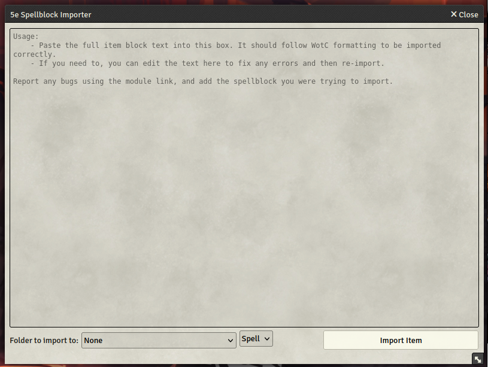

# 5e Items Importer

A comprehensive content import solution for D&D 5e in Foundry VTT. This module allows you to easily import spells, items, monsters, and other content from various sources including PDFs and text blocks.

## Features

### PDF Import
- Import content directly from PDF files
- Supports both text-based and image-based PDFs (using OCR)
- Automatically detects and categorizes different types of content
- Handles multiple content types in a single import

### Text Block Import
- Copy and paste content blocks for quick import
- Supports various content types:
  - Spells
  - Items and Equipment
  - Monsters and NPCs
  - Class Features
  - Feats
- Smart content detection and automatic categorization
- Maintains proper formatting and game mechanics

### Smart Content Processing
- Automatic content type detection
- Intelligent parsing of game mechanics
- Proper mapping to Foundry VTT data structures
- Validation of imported content

## Usage

1. Access the importer through the Items Directory
2. Click the Import button at the bottom of the window
3. Choose your import method:
   - Paste text content directly
   - Select a PDF file to import
4. Review and confirm the detected content
5. Import into your world!

### Text Import Tips
- Content name should be the first line of the block
- Formatting is preserved during import
- Supports standard 5e formatting conventions

### PDF Import Tips
- Both text-based and scanned PDFs are supported
- Multiple content blocks can be imported at once
- OCR processing is available for image-based PDFs

## Installation

1. Inside Foundry VTT, select the Game Modules tab in the Configuration and Setup menu
2. Click the Install Module button and enter the following URL: https://raw.githubusercontent.com/ArcadiaFrame/5e-items-importer/master/module.json
3. Click Install and wait for installation to complete

## Compatibility

- Requires Foundry VTT v10 or newer (verified with v12.331)
- Compatible with D&D 5e system v4.3.6 (maximum compatibility up to v4.999)
- For best results, use with the latest version of the D&D 5e system

## Support

If you encounter any issues or have suggestions for improvements, please open an issue on our [GitHub repository](https://github.com/ArcadiaFrame/5e-items-importer).

## License

This module is licensed under the MIT License. See the LICENSE file for details.
